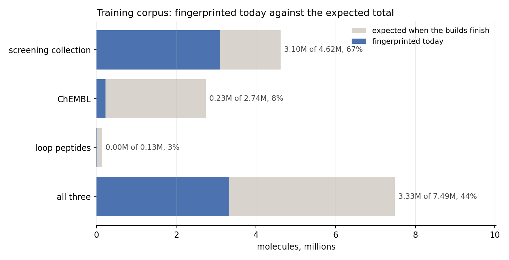

# PharmCast

**Predict a complete 3D pharmacophore fingerprint directly from a 2D structure.**

[](LICENSE)
[](https://pharmcast.ai/whitepaper/)
[](https://pharmcast.ai)

A pharmacophore fingerprint records the three-dimensional arrangement of binding
features a molecule can present, so two compounds from completely different
scaffolds can be compared on the thing a protein actually reads. Its cost has
never been the fingerprint. Of the **2.86 s** needed to fingerprint one
catalogue molecule over 100 conformers, **2.44 s is conformer generation** and
only 0.043 s is the fingerprint itself.

PharmCast reads a SMILES and predicts all 10,549 pharmacophores directly. It removes the
conformational stage rather than accelerating it, which is why the speed-up is
of a different order to what optimisation normally buys: **a complete comparison
of two molecules, from structure alone, takes 0.584 ms against 5.7 s.**

---

## The fingerprint

Every pharmacophore in the scheme is a triangle of three typed features at three
measured distances. Enumerate every combination of feature type and distance
range and you have a fixed vocabulary of triangles; each one is a bit, and a
molecule sets the bit for every triangle it can form.


*What one bit is. A three point pharmacophore is three typed features and the
three binned distances between them. Enumerating every triangle that satisfies
the triangle inequality on the bin bounds gives 10,549 distinct pharmacophores.*

Because the vocabulary is geometric rather than substructural, two molecules
with nothing in common on paper score highly if they present their features in
the same places. That is exactly the comparison a scaffold hop needs, and it is
not what a 2D fingerprint measures.


*The same pharmacophore on two unrelated scaffolds. Estradiol (above) and
diethylstilbestrol (below) each present an acceptor (p1), a donor (p2) and an
aromatic ring (p3). The distances differ, 2.7, 7.8 and 10.4 Å against 2.7, 9.2
and 11.9, but all three fall in the same bins, so both set the same bit. That is
what scaffold hopping looks like from inside the descriptor.*

## How it works


*The two routes to a fingerprint. The conventional route generates a conformer
ensemble and runs the reference calculation over it. PharmCast predicts the same
ensemble record from the two dimensional structure and skips the ensemble
entirely. Panel E is one real catalogue pair scored by PharmCast SCP v6: the
reference calculation gives a pharmacophore Tanimoto of 0.383 and PharmCast
predicts 0.364, against a two dimensional Morgan Tanimoto of 0.149. The network
is 2,059 inputs, hidden layers of 1,024 and 512, and one output unit per
pharmacophore, 10,549 in total, for 8,045,877 parameters. Batched, that is
0.584 ms against 5.7 s, which is 9,925-fold batched. That figure is end to
end and includes featurisation, which is roughly 27 times larger than the
forward pass and cannot be batched away.*

---

## Install

```bash
pip install git+https://github.com/smuskal/pharmcast.git
# or, from a clone:
pip install -e .
```

Python ≥ 3.9 with `numpy`, `torch` and `rdkit`. **CPU only**: an
8-million-parameter network gains nothing from a GPU, so there is no CUDA build
to match and no accelerator to configure.

Runs unmodified on **Apple Silicon, Intel macOS, Windows and Linux** (x86_64 and
aarch64). The package is pure Python: no compiled extension, no architecture
build step, and nothing that assumes a byte order. Word packing uses an explicit
little-endian dtype so a fingerprint means the same thing on every machine.
NumPy 2.x is used when present and 1.x falls back to a lookup table, so a stack
pinned to NumPy 1.x is not forced to upgrade.

## Get the weights

**The weights are not in this repository.** They are served, versioned and
checksummed, from **<https://pharmcast.ai/models>**.

| Model | Endpoint | SHA-256 |
|---|---|---|
| **PharmCast SCP v6** (current) | GitHub release asset `pharmcast_scp_v6.pt` | `264b5c14…1ecf94ce` |
| PharmCast SCP v5 (superseded, retained) | [`/models/pharmcast_scp_v5.pt`](https://pharmcast.ai/models/pharmcast_scp_v5.pt) | `748c558c…ad29a3be` |
| *(all releases)* | [`/models/SHA256SUMS`](https://pharmcast.ai/models/SHA256SUMS) | n/a |

```bash
# v6 is a GitHub release asset; download it from the Releases page
curl -O https://pharmcast.ai/models/SHA256SUMS
shasum -a 256 -c SHA256SUMS                      # macOS / Linux
certutil -hashfile pharmcast_scp_v6.pt SHA256    # Windows
```

**A published checkpoint is never replaced in place.** A new release is added
beside the old ones and `SHA256SUMS` is append-only, so a script pinned to a URL
keeps returning the same bytes. The weights carry the same Apache-2.0 licence as
the code.

## Quick start

Everything below is the command line. Install, download a model, run.

```bash
pip install -e .
# model weights are attached to releases, not committed
curl -LO https://github.com/smuskal/pharmcast/releases/latest/download/PharmCastSP.pt
```

Then fingerprint a file of SMILES:

```bash
pharmcast --model PharmCastSP.pt fp --in examples/data/molecules.smi --out molecules.pfp
```

Compare two molecules:

```bash
pharmcast --model PharmCastSP.pt sim \
  "C[C@]12CC[C@H]3[C@H](CCc4cc(O)ccc34)[C@@H]1CC[C@@H]2O" \
  'CC/C(=C(/CC)c1ccc(O)cc1)c1ccc(O)cc1'
```

See the bits:

```bash
pharmcast --model PharmCastSP.pt bits "CC(=O)Nc1ccc(O)cc1" --width 120
pfp2bits molecules.pfp --format positions
```

And ask the model what it is:

```bash
pharmcast --model PharmCastSP.pt card
```

## Worked examples

`examples/` holds runnable scripts and the data they use. Each takes a model
path and prints its own output; nothing needs editing first.

```bash
cd examples
./01_fingerprint.sh  /path/to/PharmCastSP.pt   # SMILES file -> native .pfp
./02_similarity.sh   /path/to/PharmCastSP.pt   # 3D vs 2D similarity, three pairs
./03_bits.sh         /path/to/PharmCastSP.pt   # fingerprints -> ones and zeros
./04_model_card.sh   /path/to/PharmCastSP.pt   # corpus and applicability domain
```

`02_similarity.sh` is the one to run first. It scores three pairs **both ways**,
by pharmacophore and by ordinary 2D similarity, because the pharmacophore score
alone does not tell you anything:

```
                                      3D (PharmCast)   2D (Morgan)
  estradiol / diethylstilbestrol      pharmacophore 0.5062   2D 0.163
  aspirin / salicylate                pharmacophore 0.4775   2D 0.448
  caffeine / ibuprofen                pharmacophore 0.0000   2D 0.087
```

Estradiol and diethylstilbestrol are unrelated in 2D and bind the same receptor.
That gap between the columns is the scaffold hop, and it is the whole reason to
compute a pharmacophore fingerprint. Aspirin and salicylate score similarly in
3D but are obviously related in 2D already, so nothing was discovered. Caffeine
and ibuprofen are unrelated both ways.

## Command line reference

```bash
pharmcast --model M.pt fp       --in library.smi --out library.pfp
pharmcast --model M.pt sim      "SMILES_A" "SMILES_B"
pharmcast --model M.pt bits     "SMILES" [--format binary|positions|words] [--width N]
pharmcast --model M.pt card
pharmcast --model M.pt pfp2bits FILE.pfp

pfp2bits FILE.pfp                              # standalone, no model needed
pfp2bits FILE.pfp --format positions --json
```

`fp` is the one that matters for throughput: it batches, and PharmCast earns its
speed in a batch rather than one molecule at a time.

Each fingerprint is **10,549 pharmacophores**, stored as **330 unsigned 32-bit words** in the *native* format, the
same words the reference calculation emits, in the same bit convention, so
existing PharmSim tooling consumes PharmCast output unchanged.

### Writing and reading `.pfp` files

`pharmcast fp` writes the native `.pfp` layout, the same one the reference
comparison tools read:

```
name  <330 unsigned 32-bit ints>  version  MW  heavy  bits  rotb  nconf  X A D H N P R
```

Everything a 2D structure can supply is filled in, so a `.pfp` written by
PharmCast is self-describing rather than an anonymous block of integers:

```
ethanol      ... v1.6  46.1   3   3  0  100 ...
phenol       ... v1.6  94.1   7  22  0  100 ...
paracetamol  ... v1.6 151.2  11  43  1  100 ...
```

`version` is the format version, `MW` the molecular weight, `heavy` the
heavy-atom count, `bits` the number of pharmacophores set, `rotb` the rotatable
bonds and `nconf` the conformer count the fingerprint represents. The seven
per-feature-type counts (`X A D H N P R`) require the reference tool's own atom
typing and are written as `0`; no comparison tool reads them, and writing a
number derived from different typing would be worse than writing none.

`pfp2bits` turns any of that back into something a human can look at:

```
$ pfp2bits library.pfp --width 120
>paracetamol  set=43/10549  version=v1.6  mw=151.2  heavy=11  bits=43  rotb=1  nconf=100
000000000000001000010001010001110000000000000000000000000100000000101100011100000000000000000000110000000000000000000001
```

It loads no model, because the fingerprints are already in the file.

---

## Accuracy

**PharmCast SCP v6**, measured on molecules fingerprinted after its training
snapshot closed, so the model cannot have seen them. 573 molecules per
population.

| Population | n | Ranking | Median error | Pearson *r* | Within 0.05 | Median MCC |
|---|---:|---:|---:|---:|---:|---:|
| Catalogue chemistry | 573 | 0.921 | 0.017 | 0.970 | 89% | 0.90 |
| ChEMBL, activity backed | 573 | 0.909 | 0.021 | 0.951 | 79% | 0.83 |
| Loop peptides | 573 | 0.889 | 0.041 | 0.930 | 59% | 0.86 |
| **All three combined** | | | **0.018** | **0.966** | **87%** | |
| *Reference against itself* | | *ceiling* | *0.006* | *0.995* | | |

Every figure above is regenerated from the released model against the
51,291-molecule post-snapshot population, seed 20260819, with one training
overlap excluded. The provenance record carries the model SHA, the seed, the
per-population membership digests and the excluded identifier.

That last row sets the scale. Rebuilding the same molecules with a different
embedding seed reproduces pair similarity to 0.006 at *r* 0.995, so the
reference calculation agrees with itself an order of magnitude more tightly than
PharmCast agrees with it. **The ground truth is not the problem**, and 0.006 is
the floor no surrogate can beat.


*PharmCast SCP v6. Predicted against real pairwise similarity on held out
molecules, by population. The dashed line is exact agreement. Catalogue
chemistry and loop peptides sit tight to it. ChEMBL compounds do not, and the
scatter is asymmetric: the surrogate over predicts more often than it under
predicts.*

### Where each model sits on the finished corpus

| Model | Training molecules | Share of the finished corpus | Catalogue median error | Catalogue Pearson *r* | Catalogue ranking |
|---|---:|---:|---:|---:|---:|
| PharmCast SP v4 | 2,597,479 | 41.9% | 0.019 | 0.964 | 0.916 |
| PharmCast SCP v5 | 2,888,503 | 46.6% | 0.018 | 0.964 | 0.919 |
| **PharmCast SCP v6** | **3,281,914** | **53.0%** | **0.017** | **0.970** | **0.921** |
| PharmCast SCP v7 | pending | pending | pending | pending | pending |
| Corpus complete | 7,487,360 | 100% | pending | pending | pending |

### The large-molecule gap is closing, and not for the obvious reason

On the size-controlled comparison, ranking accuracy on large compounds goes
**74.6% at SCP v5 to 81.1% at SCP v6**, closing most of a gap that had been flat
since v2.

The obvious explanation is wrong. **v6 holds a smaller share of heavy molecules
than v5 did**, 1.39% above 600 Da against 2.19%. The gain came from the breadth
of activity-backed chemistry ChEMBL brought, not from feeding the model more
heavy molecules. That is worth knowing before anyone plans a corpus on the
assumption that the fix for large compounds is more large compounds.

### It is not re-deriving 2D similarity


*Predicted against real pairwise similarity, coloured by two dimensional Morgan
similarity, green for the most dissimilar pairs through red for the least.
Agreement does not depend on 2D similarity, so the model is predicting three
dimensional feature geometry rather than restating its own input. PharmCast SCP
v6 on 573 screening collection molecules fingerprinted after the v6 training
snapshot closed. 30,000 pairs kept by reservoir sampling, 6,000 in each of five
2D bands. Pearson within the bands is 0.966, 0.969, 0.970, 0.970 and 0.957 from
the least 2D similar to the most. That flatness is the claim the panel makes.*

## Applicability domain: read this before trusting a score

> **PharmCast is calibrated for catalogue-like chemistry to about 600 Da,
> peptides to about 900 Da, and activity-backed ChEMBL chemistry in the band the
> corpus has reached.** Outside that range it is extrapolating.

**The upper bound moves between releases.** The ChEMBL corpus is built in
ascending molecular weight, so read `card()["applicability"]` out of the
checkpoint rather than assuming a fixed number.

The reason is in the training corpus. The screening collection is filtered at
600 Da on ingest, so it contributes nothing above that line *by construction*.
In the peptide-only SP models that left **only 1.43% of training above 600 Da,
and every molecule of it a peptide**, so a large non-peptidic drug was answered
by extrapolating from a few thousand peptides: error rose from 0.02 to 0.07 and
*r* fell from 0.97 to 0.63.

**ChEMBL exists to close exactly that gap, and it is working.** On SCP v6,
activity-backed ChEMBL chemistry scores 0.021 median error at *r* 0.951, against
0.017 and 0.970 for catalogue chemistry. The gap is now small. It is not closed:
ChEMBL is 11% fingerprinted, and the corpus is built in ascending molecular
weight, so competence extends upward as it fills rather than covering the whole
range at once.

**Peptides are now the weakest population**, at 0.041 median error and 59%
within 0.05. v6 holds 1,500 of them because the corpus was mid-rebuild. That is
the number to watch in v7, not the large-molecule figure.

A model card that hides its failure mode is worse than no model card.

## Training corpora

Where the three corpora stand today:

| Corpus | Fingerprinted today | Expected total | Complete |
|---|---:|---:|---:|
| Screening collection | 3,096,476 | 4,617,292 | 67% |
| ChEMBL | 225,788 | 2,737,190 † | 8% |
| Loop peptides | 4,000 | 132,878 | 3% |
| **All three** | **3,326,264** | **7,487,360** | **44%** |



**The peptide bar is short because the corpus is being rebuilt, not because it
shrank.** Loop peptides are being recomputed from scratch under content derived
identifiers, so the store went to zero and is climbing again from 4,000. SCP v6
was trained on 1,500 of them, which is why peptides are its weakest population.
The expected total, 132,878, has not moved.

**The finished training set is expected to be 7,487,360 molecules**, well over
twice the size of the corpus SCP v6 was trained on. **44% of it is fingerprinted
today.** The growth is not evenly distributed: the screening
collection is most of the mass, while ChEMBL is the least complete and grows the
most in proportion. Every molecule is fingerprinted with
the real 100-conformer calculation, which is what makes the corpus slow to build
and worth building.

† **ChEMBL is the only projected figure.** The screening collection and the
peptide corpus are enumerated sets whose totals are known, with only the
fingerprinting left to do. ChEMBL selection is still running, so its expected
total is an estimate and will move.

SCP v6 trained on a 3,281,914-molecule snapshot:

| Corpus | Molecules | Share | Mass range | Median |
|---|---:|---:|---|---:|
| Screening collection | 3,058,290 | 93.19% | 142 to 600 Da | 343 |
| ChEMBL, activity backed | 215,182 | 6.56% | 142 to 1000 Da | 310 |
| Large catalogue tail | 6,942 | 0.21% | 600 to 917 Da | 626 |
| Protein loop peptides | 1,500 | 0.05% | 116 to 988 Da | 571 |

The peptide corpus was being rebuilt when this snapshot was taken, so v6 carries
very few peptides. Its output layer is 10,549 wide, one per pharmacophore.

### The training set is still being built

**This is work in progress, not a finished system.** All three corpora are still
being fingerprinted: 3,326,264 of an expected 7,487,360 molecules, **44%**.
SCP v6 is the current model, trained on a 3,281,914-molecule snapshot taken
along the way.

**Work continues toward v7, v8 and beyond.** No model here is a release
candidate, and none will be until the corpora are complete. A preprint
describing the finished work is being written.

Each version is published beside its predecessors and never replaces one, so a
result computed against a given version stays reproducible.

**SCP v6 reserved no holdout split**: `validation_molecules = 0`. It is measured
a different way. Its evaluation population is the molecules fingerprinted
*after* its training snapshot was taken, which the model therefore cannot have
seen: a strict novel set of **51,291** molecules, being 38,185 screening
collection, 7,406 ChEMBL head, 3,200 ChEMBL tail and 2,500 loop peptides, with
one training overlap excluded.

That is a genuinely unseen population, but it is **not the same population** v2
through v5 were scored on, which was a fixed 9,975-molecule split. The molecular
weight distributions differ materially, so a v6 number above 600 Da is not
directly comparable with the earlier models' figure for the same band.

Every release is published beside its predecessors and never replaces one.

Naming: **S** is the screening collection, **C** is ChEMBL, **P** is peptides.
There is no peptide-only model, and "composite" means SP rather than a third
thing.

The ChEMBL corpus exists to repair a specific, measured weakness. The screening
collection is filtered at MW 600 on ingest, so in the SP models **only 1.4% of
training sat above MW 600 and every molecule of it was a peptide**. Asked about a
large non-peptidic drug, SP was extrapolating, and its error rose from 0.02 to
0.07 with r falling from 0.97 to 0.63. The ChEMBL corpus is real, activity-backed
chemistry in exactly that band, built in ascending molecular weight so the
model's competence extends upward from what it already knows rather than
jumping into a gap.

**The evaluation compounds are held out of training** by ChEMBL identifier *and*
by canonical structure, because the training corpus and the large-compound
evaluation set are drawn from the same ChEMBL band and would otherwise overlap.
Training on them would improve the reported large-compound error for an entirely
artificial reason.

Loops of two to six residues were extracted from crystal structures at 2.5 Å
resolution and R-free 0.22, capped with their real flanking atoms and checked
for backbone continuity. Each distinct peptide gets **one** fingerprint that ORs
together every observed crystal conformation along with 100 computed conformers.
Repeats are kept rather than deduplicated: how often a loop is observed in a
given shape is signal about how it occupies space.


*One loop sequence, every deposited conformation of it, and the similarity
between them. The sequence LGGK appears 217 times across 61 Protein Data Bank
entries; 201 share the same 25 heavy atoms and all 201 are drawn. Across 25,000
loop sequences the median is 0.878, which is what the ensemble record is built to
capture. Regenerated at each release, so it grows as more structures are
extracted.*

---

## Two rules for using the scores

1. **Never predict the reference of a campaign.** Fingerprint it once with the
   real calculation. There is no reason to accept model error on the one
   molecule the work is aimed at.
2. **PharmCast scores rank; they are not quoted.** The predicted fingerprint
   carries a small systematic offset in bit count, harmless for ordering and
   misleading in a report. Published numbers come from a real rescore of the
   survivors.

There is a third, which matters under optimisation pressure: **a search pointed
at PharmCast will eventually optimise its error rather than the molecule.**
Measured on a design campaign, seventeen times the search budget raised the
median surrogate score by 0.20 and the median real score by 0.02, while the
surrogate's own error over survivors went from +0.06 to +0.24. Rescore before
believing anything, and carry many survivors into that rescore rather than a top
handful.

## What is *not* here

This repository ships the model and the utilities for using it. It does **not**
ship the reference pharmacophore fingerprint generator (`pfpall` / `pfprigid`)
or any of the fingerprint-generating toolchain, and it does not redistribute any
training corpus.

## Licence

**[Apache-2.0](LICENSE)** covers code and model weights alike. Use it commercially,
fork it, embed it; keep the `LICENSE` and `NOTICE` files with it.

`NOTICE` credits the sources the model was trained on: the RCSB Protein Data
Bank (CC0), ChEMBL (CC BY-SA 3.0) and the Enamine screening collection. No
training corpus is redistributed here, only the trained parameters, and
keeping `NOTICE` intact, which Apache-2.0 already requires, satisfies the
attribution those sources ask for.

## White paper

The full method description, with the corpus construction, the evaluation
protocol and every figure, is current on SCP v6.

**Read it at <https://pharmcast.ai/whitepaper/>**, or open
[`docs/whitepaper.pdf`](docs/whitepaper.pdf), which GitHub renders inline.

`docs/whitepaper.html` is the same document and is kept here so the repository
is self-contained, but **GitHub shows HTML as source rather than rendering it**,
so a browser is the wrong way to read that file. Download it, or use one of the
two links above.

Note the evaluation protocol it describes: each version is scored on collection
molecules fingerprinted *after* that version finished training, so populations
are comparable in kind rather than identical in membership. **SCP v6 was trained
with zero holdout and has no internal validation split**, and the white paper
says so where it reports v6.

## Citation

See [CITATION.cff](CITATION.cff). A preprint is in preparation; the method it
builds on is McGregor & Muskal, *J. Chem. Inf. Comput. Sci.*,
[1999](https://www.eidogen.com/pdfs/pharmprintpaper1.pdf) and
[2000](https://www.eidogen.com/pdfs/pharmprintpaper2.pdf).

---

PharmCast™, PharmPrint™, PolyPharmPrint™, PharmSim™ and ChIP™ are trademarks of
[Eidogen-Sertanty, Inc.](https://eidogen-sertanty.com)
