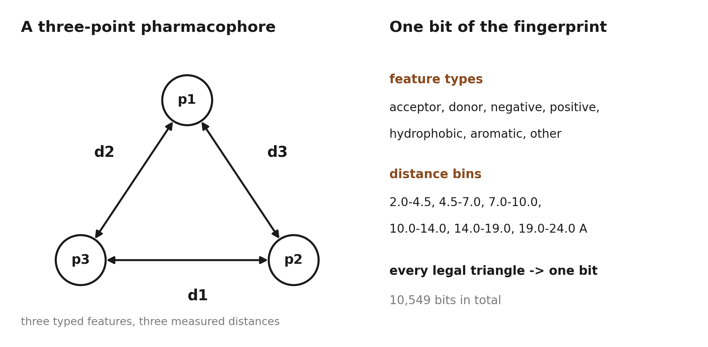
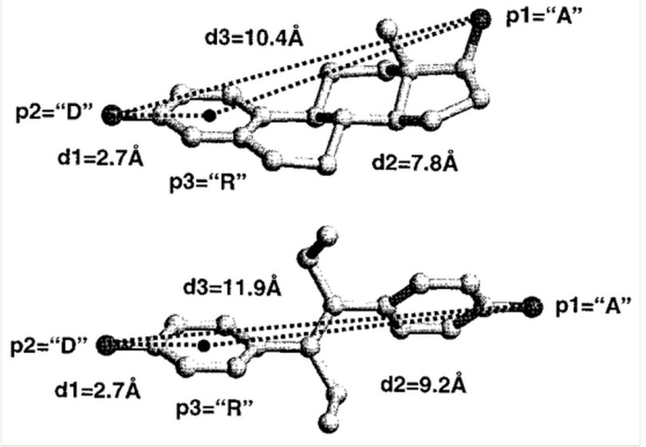
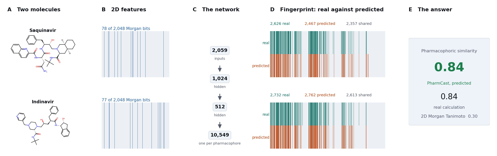
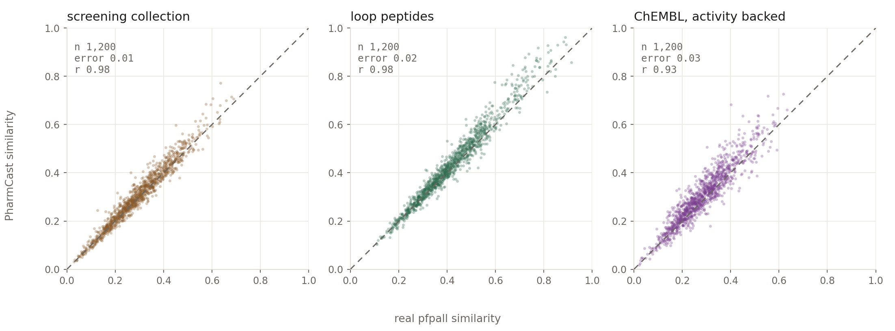
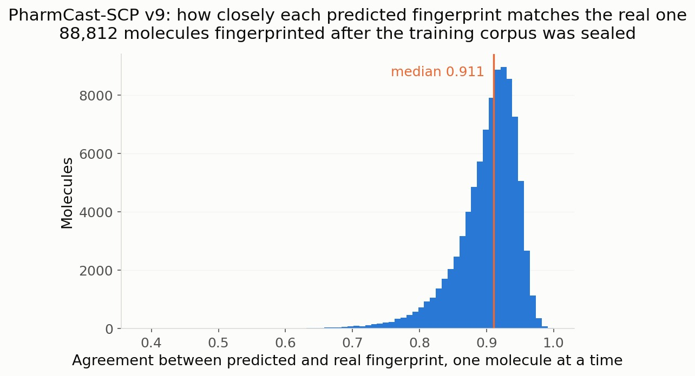
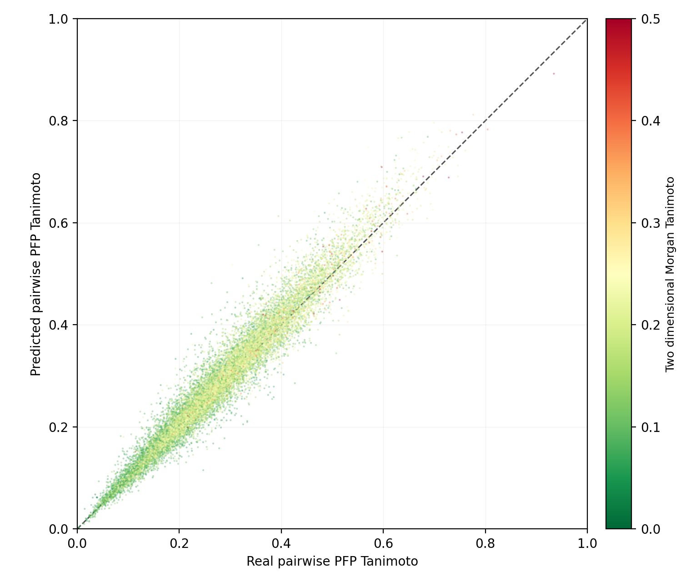
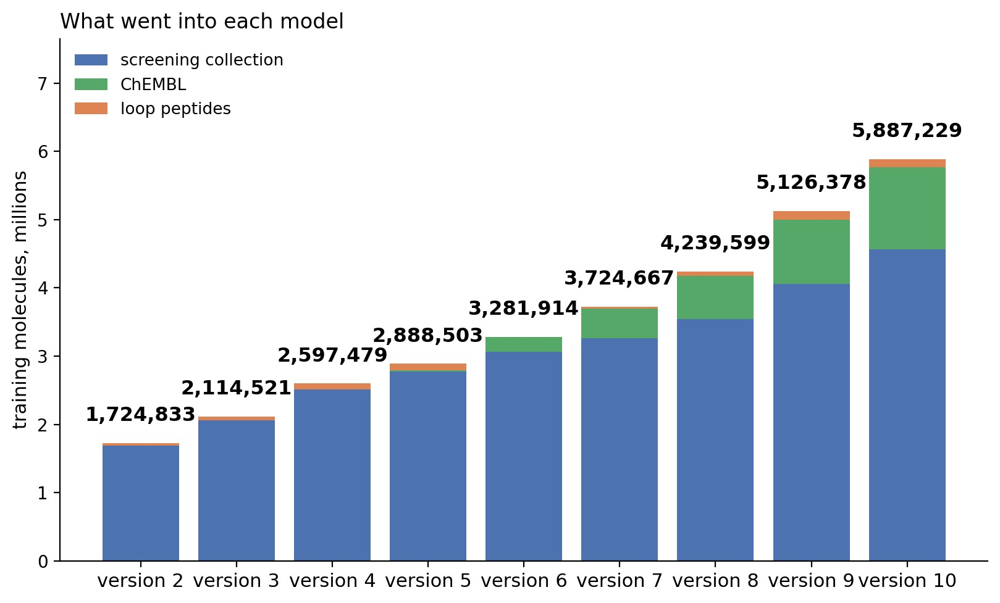
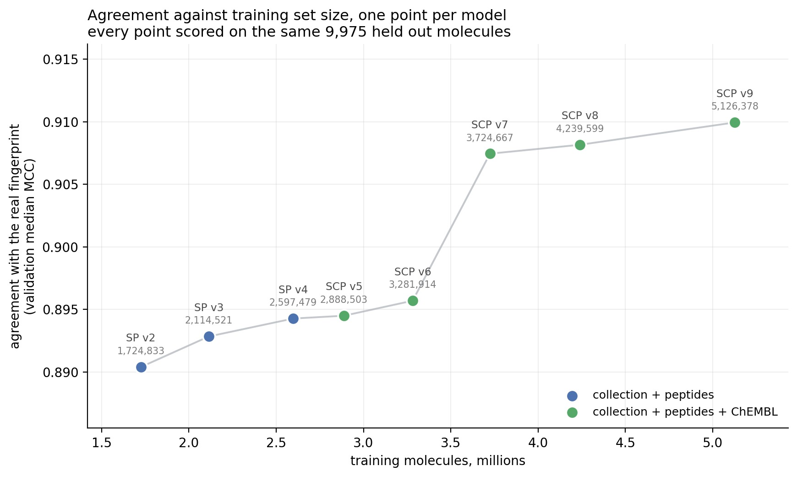
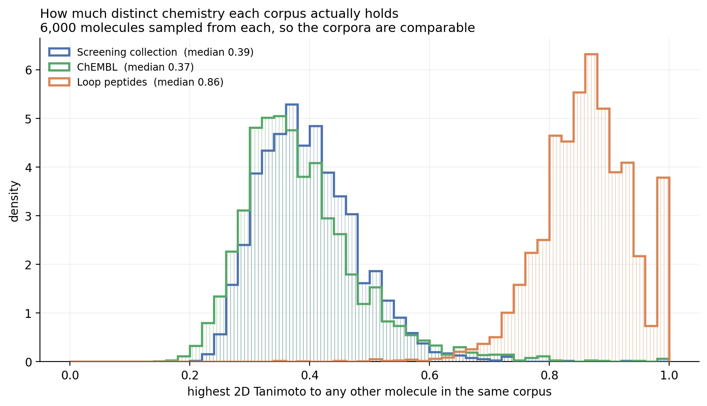
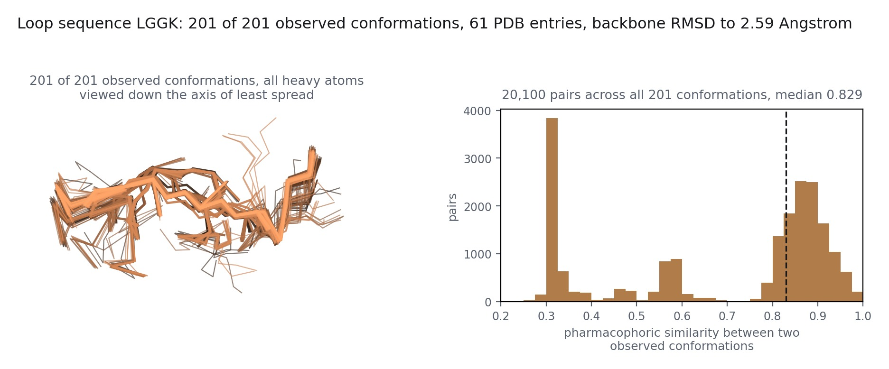

# PharmCast

**Predict a complete 3D pharmacophore fingerprint directly from a 2D structure.**

[](LICENSE)
[](https://pharmcast.ai)
[](https://pharmcast.ai/)

A pharmacophore fingerprint records the three-dimensional arrangement of binding
features a molecule can present, so two compounds from completely different
scaffolds can be compared on the thing a protein actually reads. Its cost has
never been the fingerprint. Almost all of the cost of fingerprinting a
catalog molecule is generating its conformer ensemble; the bit calculation
itself is a small fraction of it.

PharmCast reads a SMILES and predicts all 10,549 pharmacophores directly. It
removes the conformational stage rather than accelerating it, which is why the
speed-up is of a different order to what optimization normally buys.

**[Try it now at pharmcast.ai](https://pharmcast.ai/)**

- **[Fingerprint a molecule](https://pharmcast.ai/fingerprint.html)**: draw or
  paste one structure and get its complete predicted fingerprint: which of the
  10,549 pharmacophores are set, what each is as a feature triplet, and the
  fingerprint itself ready to copy in both packed 32-bit and `0`/`1` form.
- **[Compare two molecules](https://pharmcast.ai/compare.html)**: PharmSim
  similarity between two structures.

To decode a `.pfp` locally, see [`tools/pfp-decode`](tools/pfp-decode).

---

## The fingerprint

Every pharmacophore in the scheme is a triangle of three typed features at three
measured distances. Enumerate every combination of feature type and distance
range and you have a fixed vocabulary of triangles; each one is a bit, and a
molecule sets the bit for every triangle it can form.



*What one bit is. A three point pharmacophore is three typed features and the
three binned distances between them. Enumerating every triangle that satisfies
the triangle inequality on the bin bounds gives 10,549 distinct pharmacophores.*

Because the vocabulary is geometric rather than substructural, two molecules
with nothing in common on paper score highly if they present their features in
the same places. That is exactly the comparison a scaffold hop needs, and it is
not what a 2D fingerprint measures.



*The same pharmacophore on two unrelated scaffolds. Estradiol (above) and
diethylstilbestrol (below) each present an acceptor (p1), a donor (p2) and an
aromatic ring (p3). The distances differ, 2.7, 7.8 and 10.4 Å against 2.7, 9.2
and 11.9, but all three fall in the same bins, so both set the same bit. That is
what scaffold hopping looks like from inside the descriptor.*

## How it works



*The two routes to a fingerprint. The conventional route generates a conformer
ensemble and runs the reference calculation over it. PharmCast predicts the same
ensemble record from the two dimensional structure and skips the ensemble
entirely. Panel E is saquinavir against indinavir, two HIV-1 protease
inhibitors, scored by PharmCast version 10: the reference calculation gives a
pharmacophoric similarity of 0.841 and PharmCast predicts 0.843, where a two
dimensional Morgan Tanimoto puts the same pair at 0.303. That gap is the whole
point of the descriptor. The network is 2,059 inputs, hidden layers of 1,024 and
512, and one output unit per pharmacophore, 10,549 in total, for 8,045,877
parameters.*

`saquinavir`

    CC(C)(C)NC(=O)[C@@H]1C[C@@H]2CCCC[C@@H]2CN1C[C@@H](O)[C@H](Cc1ccccc1)NC(=O)[C@H](CC(N)=O)NC(=O)c1ccc2ccccc2n1

`indinavir`

    CC(C)(C)NC(=O)[C@@H]1CN(Cc2cccnc2)CCN1C[C@@H](O)C[C@@H](Cc1ccccc1)C(=O)N[C@H]1c2ccccc2C[C@H]1O

---

## Install

```bash
pip install git+https://github.com/smuskal/pharmcast.git
# or, from a clone:
pip install -e .
```

Python ≥ 3.9 with `numpy`, `torch` and `rdkit`. **CPU only**: an
8-million-parameter network gains nothing from a GPU, so there is no CUDA build
to match and no accelerator to configure.

Runs unmodified on **Apple Silicon, Intel macOS, Windows and Linux** (x86_64 and
aarch64). The package is pure Python: no compiled extension, no architecture
build step, and nothing that assumes a byte order. Word packing uses an explicit
little-endian dtype so a fingerprint means the same thing on every machine.
NumPy 2.x is used when present and 1.x falls back to a lookup table, so a stack
pinned to NumPy 1.x is not forced to upgrade.

## Get the weights

**The weights are not in this repository.** They are served, versioned and
checksummed, from **<https://pharmcast.ai/models>**.

| Model | Endpoint | SHA-256 |
|---|---|---|
| **PharmCast version 10** (current) | [`/models/pharmcast_scp_v10.pt`](https://pharmcast.ai/models/pharmcast_scp_v10.pt) | `b25ad356…d36284cf` |
| PharmCast version 9 | [`/models/pharmcast_scp_v9.pt`](https://pharmcast.ai/models/pharmcast_scp_v9.pt) | `1c0be82e…209699c6` |
| PharmCast version 8 | [`/models/pharmcast_scp_v8.pt`](https://pharmcast.ai/models/pharmcast_scp_v8.pt) | `d1389037…ac8f42ab5` |
| *(all releases, append-only)* | [`/models/SHA256SUMS`](https://pharmcast.ai/models/SHA256SUMS) | n/a |

Superseded releases move to the **[archive](https://pharmcast.ai/models/#archive)**
on the model page. They stay downloadable and their checksums stay in
`SHA256SUMS`, so a result computed against one remains reproducible; they are
not what new work should use.

```bash
curl -O https://pharmcast.ai/models/pharmcast_scp_v10.pt
curl -O https://pharmcast.ai/models/SHA256SUMS
shasum -a 256 -c SHA256SUMS                      # macOS / Linux
certutil -hashfile pharmcast_scp_v10.pt SHA256    # Windows
```

**version 10 is the current model**, and everything below describes it. Earlier
checkpoints stay downloadable and their checksums stay in `SHA256SUMS`, which is
append-only, so a result computed against one remains reproducible.

It is trained on a frozen snapshot of 5,946,696 molecules: 4,609,488 screening
collection, 1,214,214 activity-backed ChEMBL from 142 to 1000 Da, and 122,994
loop peptides. 1% was held out as a molecular-weight-stratified stopping set,
leaving 5,887,229 for gradient updates. It ran 100 epochs and the weights of
epoch 68 were restored. 2,059 binary2048 inputs, hidden layers of 1,024 and 512,
batch 256, learning rate 0.001, 10,549 outputs, 8,045,877 parameters.

**A published checkpoint is never replaced in place.** A new release is added
beside the old ones and `SHA256SUMS` is append-only, so a script pinned to a URL
keeps returning the same bytes. The weights carry the same Apache-2.0 license as
the code.

## Quick start

Everything below is the command line. Install, download a model, run.

```bash
pip install -e .
# weights are served from the site, not committed; verify what you got
curl -LO https://pharmcast.ai/models/pharmcast_scp_v10.pt
curl -LO https://pharmcast.ai/models/SHA256SUMS
shasum -a 256 -c SHA256SUMS 2>/dev/null | grep pharmcast_scp_v10
```

Then fingerprint a file of SMILES:

```bash
pharmcast --model pharmcast_scp_v10.pt fp --in examples/data/molecules.smi --out molecules.pfp
```

Compare two molecules:

```bash
pharmcast --model pharmcast_scp_v10.pt sim \
  "C[C@]12CC[C@H]3[C@H](CCc4cc(O)ccc34)[C@@H]1CC[C@@H]2O" \
  'CC/C(=C(/CC)c1ccc(O)cc1)c1ccc(O)cc1'
```

Screen a library for nearest neighbors:

```bash
pharmcast --model pharmcast_scp_v10.pt screen \
  --queries queries.smi --targets library.smi --top 10
```

Once fingerprints exist, screening needs **no model at all**:

```bash
pharmcast screen --queries queries.pfp --targets library.pfp --top 10
```

See the bits:

```bash
pharmcast --model pharmcast_scp_v10.pt bits "CC(=O)Nc1ccc(O)cc1" --width 120
pfp2bits molecules.pfp --format positions
```

And ask the model what it is:

```bash
pharmcast --model pharmcast_scp_v10.pt card
```

## Screening a library

`pharmcast screen` ranks a target set against one or more queries. Every
fingerprint in the query file is used, each ranked against the whole target
set; results can be bounded by a top-N, by a score cutoff, or by both, and
there is no cap on how many targets may be screened.

```bash
pharmcast screen --queries Q --targets T [--top N] [--cutoff X] [--out FILE]
```

`--queries` and `--targets` each take a native `.pfp`/`.pfp.gz` or a `.smi`,
which is fingerprinted through the model first. Omit `--targets` to screen the
queries against themselves, excluding self-matches. With neither `--top` nor
`--cutoff`, the default is `--top 10`; given both, you get the best N of those
at or above the cutoff.

Output is TSV with a header and one row per query per hit, ranked:

```
query_name  query_smiles  rank  target_name  target_smiles  pharmtan  query_bits  target_bits
```

Ties are broken by target name, so the ordering is reproducible across runs and
machines. Names and SMILES are written **in full**. The original truncated
names to 20 characters, and a clipped identifier is not an identifier.

### It works on any `.pfp`, whatever produced it

A `.pfp` is a **format, not a producer**. Fingerprints computed by the
reference calculation and fingerprints predicted by PharmCast are equally valid
input, and all four combinations work:

| Queries | Targets | What you are asking |
|---|---|---|
| reference | reference | ground truth against ground truth |
| predicted | predicted | predicted against predicted |
| reference | predicted | would a reference query have found this predicted library? |
| predicted | reference | does a predicted query retrieve the right reference neighbors? |

**No model is loaded when both sides are `.pfp`.** `--model` is required only
when an input is `.smi`:

```bash
pharmcast screen --queries real.pfp --targets predicted.pfp --top 10
```

Nothing infers or requires a producer. What *is* checked is the format
contract: every record must carry 330 unsigned 32-bit words, and a declared
set-bit count may not exceed 10,549.

Each run writes the provenance of both inputs into the output header, so a
screen that mixes real and predicted fingerprints never leaves a reader
guessing which side was which:

```
# queries: reference.pfp (native .pfp, 93 records, version v1.6, nconf 1)
# targets: predicted.pfp (native .pfp, 6 records, version v1.6, nconf 100)
```

**One honest hazard when mixing them.** A 100-conformer ensemble compared
against a single-conformer fingerprint scores lower for that reason alone. When
the two sides declare different `nconf`, the command warns on stderr, naming
both values, and continues. The comparison is meaningful, it just must not be
read as though both sides had the same conformational coverage.

### Scale

Targets are streamed in chunks with a bounded top-N heap per query, so memory
is a function of the query count and N, never of how many targets there are.
A full queries-by-targets matrix is never materialized: `pharmtan_matrix`
remains the right tool for a few thousand fingerprints, but at four million
targets one query row alone is 32 MB.

### Progress on a long screen

A screen of a large collection runs for minutes, so `screen` reports where it is
while it works. Progress goes to stderr, once per 20,000-target chunk, and the
final throughput line is printed on completion as before:

```
$ pharmcast --model pharmcast_scp_v10.pt screen \
    --queries queries.smi --targets collection.smi --top 5 --out hits.tsv
  1,240,000/4,653,831 targets  26.6%  4,943/s  eta 11m30s
```

On a terminal that line is rewritten in place. When stderr is redirected each
update is written as its own line instead, so a log file stays readable. Use
`--progress` to force it on when stderr is not a terminal, `--no-progress` to
turn it off.

The percentage and the estimate come from counting the target file first, which
is one cheap pass. If the file cannot be counted, the report gives the count
and the rate without a percentage rather than inventing a denominator.


The coefficient is exactly the one `pharmtan` computes pairwise, same popcount
over the same packed words, vectorized across a chunk. `tests/test_screen.py`
asserts that rather than asking you to take it on trust.

## Worked examples

`examples/` holds runnable scripts and the data they use. Each takes a model
path and prints its own output; nothing needs editing first.

```bash
cd examples
./01_fingerprint.sh  /path/to/pharmcast_scp_v10.pt   # SMILES file -> native .pfp
./02_similarity.sh   /path/to/pharmcast_scp_v10.pt   # 3D vs 2D similarity, three pairs
./03_bits.sh         /path/to/pharmcast_scp_v10.pt   # fingerprints -> ones and zeros
./04_model_card.sh   /path/to/pharmcast_scp_v10.pt   # training set and applicability domain
./05_screen.sh       /path/to/pharmcast_scp_v10.pt   # rank a library against queries
```

`02_similarity.sh` is the one to run first. It scores three pairs **both ways**,
by pharmacophore and by ordinary 2D similarity, because the pharmacophore score
alone does not tell you anything:

```
                                      3D (PharmCast)   2D (Morgan)
  estradiol / diethylstilbestrol      pharmacophore 0.784    2D 0.163
  aspirin / salicylate                pharmacophore 0.363    2D 0.448
  caffeine / ibuprofen                pharmacophore 0.000    2D 0.087
```

*Numbers above are real output from `02_similarity.sh` on **version 10**. They move
with the model, so if your output differs, check the checkpoint's sha256 and
your RDKit version before anything else.*

Estradiol and diethylstilbestrol are unrelated in 2D and bind the same receptor.
That gap between the columns is the scaffold hop, and it is the whole reason to
compute a pharmacophore fingerprint. Aspirin and salicylate score similarly in
3D but are obviously related in 2D already, so nothing was discovered. Caffeine
and ibuprofen are unrelated both ways.

## Command line reference

```bash
pharmcast --model M.pt fp       --in library.smi --out library.pfp
pharmcast --model M.pt sim      "SMILES_A" "SMILES_B"
pharmcast --model M.pt bits     "SMILES" [--format binary|positions|words] [--width N]
pharmcast --model M.pt card
pharmcast --model M.pt pfp2bits FILE.pfp

pharmcast --model M.pt screen   --queries Q.smi --targets T.smi [--top N] [--cutoff X] [--out FILE]
pharmcast screen                --queries Q.pfp --targets T.pfp   # no model needed

pfp2bits FILE.pfp                              # standalone, no model needed
pfp2bits FILE.pfp --format positions --json
```

Two commands need **no model**, because they operate on fingerprints that
already exist rather than predicting new ones: `pfp2bits`, and `screen` when
both of its inputs are `.pfp`.

`fp` is the one that matters for throughput: it batches, and PharmCast earns its
speed in a batch rather than one molecule at a time.

Each fingerprint is **10,549 pharmacophores**, stored as **330 unsigned 32-bit words** in the *native* format, the
same words the reference calculation emits, in the same bit convention, so
existing PharmSim tooling consumes PharmCast output unchanged.

### Writing and reading `.pfp` files

`pharmcast fp` writes the native `.pfp` layout, the same one the reference
comparison tools read:

```
name  <330 unsigned 32-bit ints>  version  MW  heavy  bits  rotb  nconf  X A D H N P R
```

Everything a 2D structure can supply is filled in, so a `.pfp` written by
PharmCast is self-describing rather than an anonymous block of integers:

```
ethanol      ... v1.6  46.1   3   3  0  100 ...
phenol       ... v1.6  94.1   7  17  0  100 ...
paracetamol  ... v1.6 151.2  11  46  1  100 ...
```

`version` is the format version, `MW` the molecular weight, `heavy` the
heavy-atom count, `bits` the number of pharmacophores set, `rotb` the rotatable
bonds and `nconf` the conformer count the fingerprint represents. The seven
per-feature-type counts (`X A D H N P R`) require the reference tool's own atom
typing and are written as `0`; no comparison tool reads them, and writing a
number derived from different typing would be worse than writing none.

`pfp2bits` turns any of that back into something a human can look at:

```
$ pfp2bits library.pfp --width 120
>paracetamol  set=47/10549  version=v1.6  mw=151.2  heavy=11  bits=47  rotb=1  nconf=100
111000101000100001000000000000000000001000000000000000000000000000000000000000000000111000110100011000001000000000000000
```

It loads no model, because the fingerprints are already in the file.

*Bit counts above are **version 10**. `--width 120` prints the first 120 of 10,549
pharmacophores, so it is a prefix and not a short fingerprint. The same
molecule on <https://pharmcast.ai/fingerprint.html> prints all 10,549 and begins
with these same 120 characters. The counts move with the model.*

---

## Accuracy

**PharmCast version 10**, measured on molecules the model cannot have seen.

The peptide row is the **reserved peptide test set**: 13,500 loops held back from the training set and never trained on. It is the largest and most stable of the three
populations and the one to read first.

The catalog row is 155,648 real, purchasable June 2026 catalog compounds
that the ingest filter excluded, so no version has trained on them and none can.
They span 42 to 977 Da. The ChEMBL row is every ChEMBL molecule fingerprinted
after the training set was frozen.

| Population | n | Median error | Within 0.05 | Pearson *r* | Ranking acc. |
|---|---:|---:|---:|---:|---:|
| Loop peptides, reserved test set | 13,500 | 0.016 | 88% | 0.984 | 0.952 |
| ChEMBL, activity backed | 139,700 | 0.027 | 75% | 0.936 | 0.889 |
| Catalog chemistry | 155,648 | 0.008 | 89% | 0.980 | 0.936 |
| *Reference against itself* | | *0.006* | | *0.995* | *ceiling* |

The held-out ChEMBL molecules span 374.4 to 398.1 Da and nothing else, because the
fingerprint build proceeds in ascending molecular weight.

Ranking accuracy is the fraction of molecule triples the model orders the same
way the reference does, exact ties excluded.

ChEMBL is the weakest population: error is about 50% higher than on catalog
chemistry and roughly one pair in five falls outside 0.05. Error rises to
**0.041 above 600 Da**, where coverage of the training set is thinnest.

Per fingerprint rather than per pair: **median MCC 0.914** on the 13,500 molecule
reserved peptide test set, with a 10th percentile of 0.846 and a 90th of 0.958.

*These are the figures in the preprint, which is the ground truth for numbers
and figures alike.*

That ceiling row sets the scale. Rebuilding the same molecules with a different
embedding seed reproduces pair similarity to 0.006 at *r* 0.995, so the
reference calculation agrees with itself an order of magnitude more tightly than
PharmCast agrees with it. **The ground truth is not the problem**, and 0.006 is
the floor no surrogate can beat.



*PharmCast **version 10**. Predicted against real pairwise similarity on held out
molecules, by population. The dashed line is exact agreement. Catalog
chemistry and loop peptides sit tight to it; ChEMBL compounds are the widest of
the three.*



*How closely each individual predicted fingerprint matches the real one, as the
Matthews correlation coefficient per molecule. **version 10** on 155,648 Enamine
test cases. Median 0.881.*

### It is not re-deriving 2D similarity



*Predicted against reference pairwise similarity, colored by two dimensional
Morgan similarity, green for the most dissimilar pairs through red for the least.
Agreement does not depend on two dimensional similarity, so the model is
predicting three dimensional feature geometry rather than restating its own
input. PharmCast version 10 on 25,165 unique held-out pairs, stratified into five
two dimensional bands. Pearson within the bands is 0.966, 0.981, 0.973, 0.959 and
0.942, from the least two dimensionally similar to the most.*

## Applicability domain: read this before trusting a score

> **PharmCast is calibrated for catalog-like chemistry to about 600 Da,
> peptides to about 900 Da, and activity-backed ChEMBL chemistry in the band the > training set has reached.** Outside that range it is extrapolating.

**The upper bound moves between releases.** The ChEMBL source set is built in ascending molecular weight, so read `card()["applicability"]` out of the
checkpoint rather than assuming a fixed number.

The reason is in the training set. The screening collection is filtered at
600 Da on ingest, so it contributes nothing above that line *by construction*.
In the peptide-only SP models that left **only 1.43% of training above 600 Da,
and every molecule of it a peptide**, so a large non-peptidic drug was answered
by extrapolating from a few thousand peptides: error rose from 0.02 to 0.07 and
*r* fell from 0.97 to 0.63.

**ChEMBL exists to close exactly that gap, and it is working.** Activity-backed
ChEMBL chemistry scores 0.027 median error at *r* 0.936, against 0.008 and 0.980
for catalog chemistry. The gap is now small. It is not closed: the training set is built in ascending molecular weight, so competence extends upward as it fills
rather than covering the whole range at once. ChEMBL remains the widest of the
three populations and is the number to watch.

A model card that hides its failure mode is worse than no model card.

## Training sets

**What went into each model.** The training set grows with the version number.



*Training molecules per release, by source. version 10 trains on 5,887,229.
Each release draws on the same three sources.*

**What that buys.** Agreement against training set size, one point per
release.



*Agreement with the real fingerprint against training set size. Returns from growth in the training set are real but diminishing.*

The three source sets at the version 10 snapshot:

| Source set | Molecules fingerprinted at the version 10 snapshot |
|---|---:|
| Screening collection | 4,609,488 |
| ChEMBL | 1,214,214 |
| Loop peptides | 136,494 |
| **All three** | **5,960,196** |

Every molecule is fingerprinted with the real 100-conformer calculation,
which is what makes it slow to build.



*How much distinct chemistry each source set holds. For every molecule, the
highest two dimensional Tanimoto to any other molecule in the same source set, so
a distribution sitting high means that set is largely analog series. Medians are
0.389 for the screening collection, 0.368 for ChEMBL and 0.864 for the loop
peptides, on the same 6,000 molecule sample from each, because nearest neighbor
similarity rises with sample size and unequal samples cannot be compared.*

version 10 trained on a 5,946,696-molecule snapshot, of which 5,887,229 were used
for gradient updates and 59,467 reserved for early stopping:

| Source set | Molecules | Share |
|---|---:|---:|
| Screening collection | 4,609,488 | 77.51% |
| ChEMBL, activity backed | 1,214,214 | 20.42% |
| Protein loop peptides | 122,994 | 2.07% |

Its output layer is 10,549 wide, one per pharmacophore.

Each version is published beside its predecessors and never replaces one, so a
result computed against a given version stays reproducible.

**version 10 reserves a stopping split** of 59,467 molecules, 1% of the snapshot
stratified by molecular weight, used only for early stopping, and the released
weights are the epoch-68 ones restored after the run.
Accuracy is then measured on a separate population: molecules fingerprinted *after* the training set was frozen, which the model cannot have seen.

Every release is published beside its predecessors and never replaces one.

Naming: **S** is the screening collection, **C** is ChEMBL, **P** is peptides.
There is no peptide-only model, and "composite" means SP rather than a third
thing.

The ChEMBL source set exists to repair a specific, measured weakness. The screening
collection is filtered at MW 600 on ingest, so in the SP models **only 1.4% of
training sat above MW 600 and every molecule of it was a peptide**. Asked about a
large non-peptidic drug, SP was extrapolating, and its error rose from 0.02 to
0.07 with r falling from 0.97 to 0.63. The ChEMBL source set is real, activity-backed chemistry in exactly that band, built in ascending molecular weight so the
model's competence extends upward from what it already knows rather than
jumping into a gap.

**The evaluation compounds are held out of training** by ChEMBL identifier *and*
by canonical structure, because the training set and the large-compound evaluation set are drawn from the same ChEMBL band and would otherwise overlap.
Training on them would improve the reported large-compound error for an entirely
artificial reason.

Loops of two to six residues were extracted from crystal structures at 2.5 Å
resolution and R-free 0.22, capped with their real flanking atoms and checked
for backbone continuity. Each distinct peptide gets **one** fingerprint that ORs
together every observed crystal conformation along with 100 computed conformers.
Repeats are kept rather than deduplicated: how often a loop is observed in a
given shape is signal about how it occupies space.



*One loop sequence, every deposited conformation of it, and the similarity
between them. The sequence LGGK appears 217 times across 61 Protein Data Bank
entries; 201 share the same 25 heavy atoms and all 201 are drawn. Across 25,000
loop sequences the median is 0.878, which is what the ensemble record is built to
capture. Regenerated at each release, so it grows as more structures are
extracted.*

## License

**[Apache-2.0](LICENSE)** covers code and model weights alike. Use it commercially,
fork it, embed it; keep the `LICENSE` and `NOTICE` files with it.

`NOTICE` credits the sources the model was trained on: the RCSB Protein Data
Bank (CC0), ChEMBL (CC BY-SA 3.0) and the Enamine screening collection.
Keeping `NOTICE` intact, which Apache-2.0 already requires, satisfies the
attribution those sources ask for.

## Citation

See [CITATION.cff](CITATION.cff). The method it
builds on is McGregor & Muskal, *J. Chem. Inf. Comput. Sci.*,
[1999](https://www.eidogen.com/pdfs/pharmprintpaper1.pdf) and
[2000](https://www.eidogen.com/pdfs/pharmprintpaper2.pdf).

---

PharmCast™, PharmPrint™, PolyPharmPrint™, PharmSim™ and ChIP™ are trademarks of
[Eidogen-Sertanty, Inc.](https://eidogen-sertanty.com)
