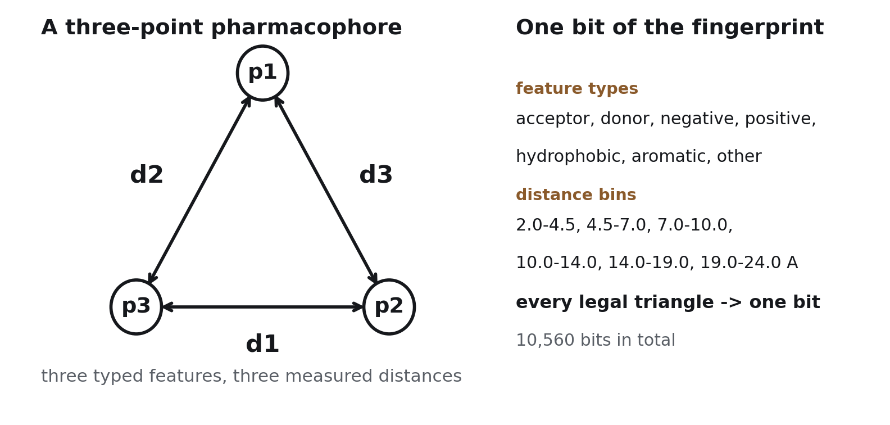
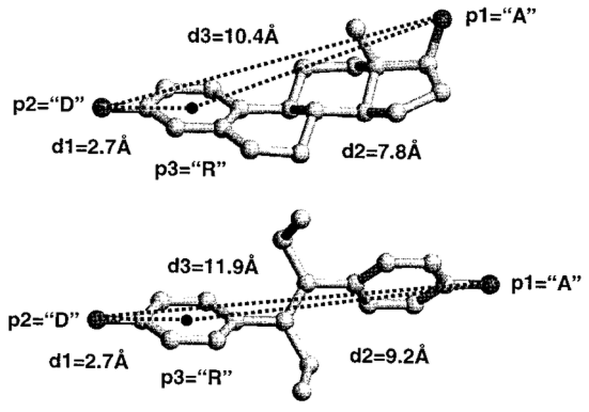
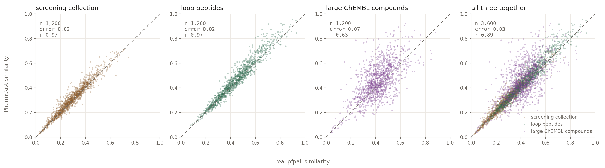
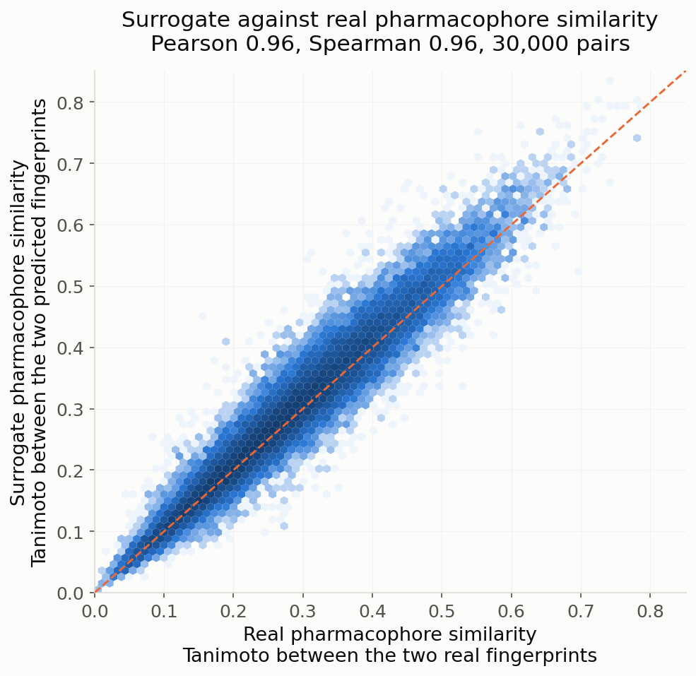
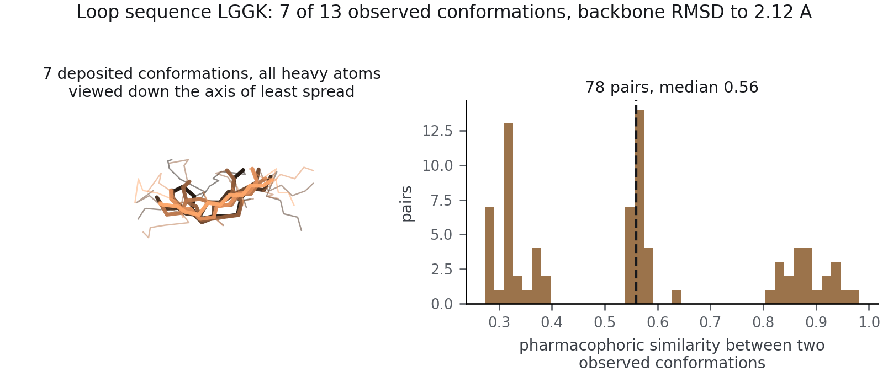

# PharmCast

**Predict a complete 3D pharmacophore fingerprint directly from a 2D structure.**

[](LICENSE)
[](https://pharmcast.ai)

A pharmacophore fingerprint records the three-dimensional arrangement of binding
features a molecule can present, so two compounds from completely different
scaffolds can be compared on the thing a protein actually reads. Its cost has
never been the fingerprint. Of the **2.48 s** needed to fingerprint one
catalogue molecule over 100 conformers, **2.44 s is conformer generation** and
only 0.043 s is the fingerprint itself.

PharmCast reads a SMILES and predicts all 10,560 bits directly. It removes the
conformational stage rather than accelerating it, which is why the speed-up is
of a different order to what optimisation normally buys: **a complete comparison
of two molecules, from structure alone, takes 0.034 ms against 5.0 s.**

---

## The fingerprint

Every pharmacophore in the scheme is a triangle of three typed features at three
measured distances. Enumerate every combination of feature type and distance
range and you have a fixed vocabulary of triangles; each one is a bit, and a
molecule sets the bit for every triangle it can form.



Because the vocabulary is geometric rather than substructural, two molecules
with nothing in common on paper score highly if they present their features in
the same places. That is exactly the comparison a scaffold hop needs, and it is
not what a 2D fingerprint measures.



---

## Install

```bash
pip install git+https://github.com/smuskal/pharmcast.git
# or, from a clone:
pip install -e .
```

Python ≥ 3.9 with `numpy`, `torch` and `rdkit`. **CPU only**: an
8-million-parameter network gains nothing from a GPU, so there is no CUDA build
to match and no accelerator to configure.

Runs unmodified on **Apple Silicon, Intel macOS, Windows and Linux** (x86_64 and
aarch64). The package is pure Python: no compiled extension, no architecture
build step, and nothing that assumes a byte order. Word packing uses an explicit
little-endian dtype so a fingerprint means the same thing on every machine.
NumPy 2.x is used when present and 1.x falls back to a lookup table, so a stack
pinned to NumPy 1.x is not forced to upgrade.

## Get the weights

**The weights are not in this repository.** They are served, versioned and
checksummed, from **<https://pharmcast.ai/models>**.

| Model | Endpoint | SHA-256 |
|---|---|---|
| **PharmCast SCP v5** (current) | [`/models/pharmcast_scp_v5.pt`](https://pharmcast.ai/models/pharmcast_scp_v5.pt) | `748c558c…ad29a3be` |
| PharmCast SP v4 (superseded, retained) | [`/models/pharmcast_sp_v4.pt`](https://pharmcast.ai/models/pharmcast_sp_v4.pt) | `d1f9c735…dc4f9252` |
| *(all releases)* | [`/models/SHA256SUMS`](https://pharmcast.ai/models/SHA256SUMS) | n/a |

```bash
curl -O https://pharmcast.ai/models/pharmcast_scp_v5.pt
curl -O https://pharmcast.ai/models/SHA256SUMS
shasum -a 256 -c SHA256SUMS                      # macOS / Linux
certutil -hashfile pharmcast_scp_v5.pt SHA256    # Windows
```

**A published checkpoint is never replaced in place.** A new release is added
beside the old ones and `SHA256SUMS` is append-only, so a script pinned to a URL
keeps returning the same bytes. The weights carry the same Apache-2.0 licence as
the code.

## Quick start

Everything below is the command line. Install, download a model, run.

```bash
pip install -e .
# model weights are attached to releases, not committed
curl -LO https://github.com/smuskal/pharmcast/releases/latest/download/PharmCastSP.pt
```

Then fingerprint a file of SMILES:

```bash
pharmcast --model PharmCastSP.pt fp --in examples/data/molecules.smi --out molecules.pfp
```

Compare two molecules:

```bash
pharmcast --model PharmCastSP.pt sim \
  "C[C@]12CC[C@H]3[C@H](CCc4cc(O)ccc34)[C@@H]1CC[C@@H]2O" \
  'CC/C(=C(/CC)c1ccc(O)cc1)c1ccc(O)cc1'
```

See the bits:

```bash
pharmcast --model PharmCastSP.pt bits "CC(=O)Nc1ccc(O)cc1" --width 120
pfp2bits molecules.pfp --format positions
```

And ask the model what it is:

```bash
pharmcast --model PharmCastSP.pt card
```

## Worked examples

`examples/` holds runnable scripts and the data they use. Each takes a model
path and prints its own output; nothing needs editing first.

```bash
cd examples
./01_fingerprint.sh  /path/to/PharmCastSP.pt   # SMILES file -> native .pfp
./02_similarity.sh   /path/to/PharmCastSP.pt   # 3D vs 2D similarity, three pairs
./03_bits.sh         /path/to/PharmCastSP.pt   # fingerprints -> ones and zeros
./04_model_card.sh   /path/to/PharmCastSP.pt   # corpus and applicability domain
```

`02_similarity.sh` is the one to run first. It scores three pairs **both ways**,
by pharmacophore and by ordinary 2D similarity, because the pharmacophore score
alone does not tell you anything:

```
                                      3D (PharmCast)   2D (Morgan)
  estradiol / diethylstilbestrol      pharmacophore 0.5062   2D 0.163
  aspirin / salicylate                pharmacophore 0.4775   2D 0.448
  caffeine / ibuprofen                pharmacophore 0.0000   2D 0.087
```

Estradiol and diethylstilbestrol are unrelated in 2D and bind the same receptor.
That gap between the columns is the scaffold hop, and it is the whole reason to
compute a pharmacophore fingerprint. Aspirin and salicylate score similarly in
3D but are obviously related in 2D already, so nothing was discovered. Caffeine
and ibuprofen are unrelated both ways.

## Command line reference

```bash
pharmcast --model M.pt fp       --in library.smi --out library.pfp
pharmcast --model M.pt sim      "SMILES_A" "SMILES_B"
pharmcast --model M.pt bits     "SMILES" [--format binary|positions|words] [--width N]
pharmcast --model M.pt card
pharmcast --model M.pt pfp2bits FILE.pfp

pfp2bits FILE.pfp                              # standalone, no model needed
pfp2bits FILE.pfp --format positions --json
```

`fp` is the one that matters for throughput: it batches, and PharmCast earns its
speed in a batch rather than one molecule at a time.

Each fingerprint is **330 unsigned 32-bit words** in the *native* format, the
same words the reference calculation emits, in the same bit convention, so
existing PharmSim tooling consumes PharmCast output unchanged.

### Writing and reading `.pfp` files

`pharmcast fp` writes the native `.pfp` layout, the same one the reference
comparison tools read:

```
name  <330 unsigned 32-bit ints>  version  MW  heavy  bits  rotb  nconf  X A D H N P R
```

Everything a 2D structure can supply is filled in, so a `.pfp` written by
PharmCast is self-describing rather than an anonymous block of integers:

```
ethanol      ... v1.6  46.1   3   3  0  100 ...
phenol       ... v1.6  94.1   7  22  0  100 ...
paracetamol  ... v1.6 151.2  11  43  1  100 ...
```

`version` is the format version, `MW` the molecular weight, `heavy` the
heavy-atom count, `bits` the number of pharmacophores set, `rotb` the rotatable
bonds and `nconf` the conformer count the fingerprint represents. The seven
per-feature-type counts (`X A D H N P R`) require the reference tool's own atom
typing and are written as `0`; no comparison tool reads them, and writing a
number derived from different typing would be worse than writing none.

`pfp2bits` turns any of that back into something a human can look at:

```
$ pfp2bits library.pfp --width 120
>paracetamol  set=43/10549  version=v1.6  mw=151.2  heavy=11  bits=43  rotb=1  nconf=100
000000000000001000010001010001110000000000000000000000000100000000101100011100000000000000000000110000000000000000000001
```

It loads no model, because the fingerprints are already in the file.

---

## Accuracy

Measured on molecules the model has never seen, on a validation set held fixed
across every release so versions stay comparable.



| Regime | Median error | Correlation *r* | Pairwise ranking |
|---|---:|---:|---:|
| Catalogue chemistry | 0.019 | 0.968 | 92% |
| Loop peptides | 0.02 | 0.97 | n/a |
| Large compounds, above 600 Da | 0.065 | 0.72 | 71% |
| *The real calculation against itself* | *0.006* | *0.995* | *ceiling* |

### Interim numbers, not a trend

The letters name the corpora, not the version: **S**creening collection,
**C**hEMBL, **P**eptides.

These figures come from a corpus that is **roughly half built** and still
changing in composition. They describe this checkpoint and nothing more.
Conclusions about what the data buys wait until the corpora are complete and the
fully trained model exists.

That last row sets the scale. Rebuilding the same molecules with a different
embedding seed reproduces pair similarity to 0.006 at *r* 0.995, which is the reference
agrees with itself an order of magnitude more tightly than PharmCast agrees with
it. **The ground truth is not the problem**, and 0.006 is the floor no surrogate
can beat.



## Applicability domain: read this before trusting a score

> **PharmCast is calibrated for catalogue-like chemistry to about 600 Da,
> peptides to about 900 Da, and activity-backed ChEMBL chemistry in the band the
> corpus has reached.** Outside that range it is extrapolating.

**The upper bound moves between releases.** The ChEMBL corpus is built in
ascending molecular weight, so read `card()["applicability"]` out of the
checkpoint rather than assuming a fixed number.

The reason is entirely in the training corpus. The screening collection is
filtered at 600 Da on ingest, so it contributes nothing above that line *by
construction*. Only about **37,060 training molecules, 1.43% of the corpus,
sit above 600 Da, and every one of them is a peptide.** Above 800 Da it is
0.10%. So when PharmCast is asked about a large non-peptide drug it is
extrapolating from a few thousand peptides, and the error rises from 0.02 to
0.07 while *r* falls from 0.97 to 0.63. This is a genuine size effect and not
merely a harder task: a matched-spread catalogue control gives 92% on the
identical protocol.

A model card that hides its failure mode is worse than no model card.

## Training corpora

**PharmCast-SP v4** (2026-08-21):

| Corpus | Fingerprinted today | Expected total | Complete |
|---|---:|---:|---:|
| Screening collection | 2,955,423 | 4,619,276 | 64% |
| ChEMBL | 142,482 | 1,412,742 † | 10% |
| Loop peptides | 108,786 | 132,878 | 82% |
| **All three** | **3,206,691** | **6,164,896** | **52%** |

**The finished training set is expected to be about 6.2 million molecules**, and
roughly half of it is fingerprinted today. Every molecule is fingerprinted with
the real 100-conformer calculation, which is what makes the corpus slow to build
and worth building.

† **ChEMBL is the only projected figure.** The screening collection and the
peptide corpus are enumerated sets whose totals are known, with only the
fingerprinting left to do. ChEMBL selection is still running, so its expected
total is an estimate and will move.

SCP v5 trained on a 2,888,503-molecule snapshot of these three corpora as they
stood on 23 August 2026.

### Why the versions exist

All three corpora are still being fingerprinted and a model is trained
periodically as they grow; **v6 is in progress.** Each release is a snapshot, not
a conclusion.

The validation split has never moved — the same 9,975 molecules since v2 — so
every model is measured on identical ground. That is what will make it possible
to *estimate the performance of the finished model from these partial ones*, and
to see whether the curve is still climbing or has converged, before the corpora
are complete. Every release is published beside its predecessors and never
replaces one.

Naming: **S** is the screening collection, **C** is ChEMBL, **P** is peptides.
There is no peptide-only model, and "composite" means SP rather than a third
thing.

The ChEMBL corpus exists to repair a specific, measured weakness. The screening
collection is filtered at MW 600 on ingest, so in SP **only 1.4% of training
sits above MW 600 and every molecule of it is a peptide**. Asked about a large
non-peptidic drug, SP is extrapolating, and its error rises from 0.02 to 0.07
with r falling from 0.97 to 0.63. The ChEMBL corpus is real, activity-backed
chemistry in exactly that band, built in ascending molecular weight so the
model's competence extends upward from what it already knows rather than
jumping into a gap.

**The evaluation compounds are held out of training** by ChEMBL identifier *and*
by canonical structure, because the training corpus and the large-compound
evaluation set are drawn from the same ChEMBL band and would otherwise overlap.
Training on them would improve the reported large-compound error for an entirely
artificial reason.

Loops of two to six residues were extracted from crystal structures at 2.5 Å
resolution and R-free 0.22, capped with their real flanking atoms and checked
for backbone continuity. Each distinct peptide gets **one** fingerprint that ORs
together every observed crystal conformation along with 100 computed conformers.
Repeats are kept rather than deduplicated: how often a loop is observed in a
given shape is signal about how it occupies space.



---

## Two rules for using the scores

1. **Never predict the reference of a campaign.** Fingerprint it once with the
   real calculation. There is no reason to accept model error on the one
   molecule the work is aimed at.
2. **PharmCast scores rank; they are not quoted.** The predicted fingerprint
   carries a small systematic offset in bit count, harmless for ordering and
   misleading in a report. Published numbers come from a real rescore of the
   survivors.

There is a third, which matters under optimisation pressure: **a search pointed
at PharmCast will eventually optimise its error rather than the molecule.**
Measured on a design campaign, seventeen times the search budget raised the
median surrogate score by 0.20 and the median real score by 0.02, while the
surrogate's own error over survivors went from +0.06 to +0.24. Rescore before
believing anything, and carry many survivors into that rescore rather than a top
handful.

## What is *not* here

This repository ships the model and the utilities for using it. It does **not**
ship the reference pharmacophore fingerprint generator (`pfpall` / `pfprigid`)
or any of the fingerprint-generating toolchain, and it does not redistribute any
training corpus.

## Licence

**[Apache-2.0](LICENSE)** covers code and model weights alike. Use it commercially,
fork it, embed it; keep the `LICENSE` and `NOTICE` files with it.

`NOTICE` credits the sources the model was trained on: the RCSB Protein Data
Bank (CC0), ChEMBL (CC BY-SA 3.0) and the Enamine screening collection. No
training corpus is redistributed here, only the trained parameters, and
keeping `NOTICE` intact, which Apache-2.0 already requires, satisfies the
attribution those sources ask for.

## Citation

See [CITATION.cff](CITATION.cff). A preprint is in preparation; the method it
builds on is McGregor & Muskal, *J. Chem. Inf. Comput. Sci.*,
[1999](https://www.eidogen.com/pdfs/pharmprintpaper1.pdf) and
[2000](https://www.eidogen.com/pdfs/pharmprintpaper2.pdf).

---

PharmCast™, PharmPrint™, PolyPharmPrint™, PharmSim™ and ChIP™ are trademarks of
[Eidogen-Sertanty, Inc.](https://eidogen-sertanty.com)
